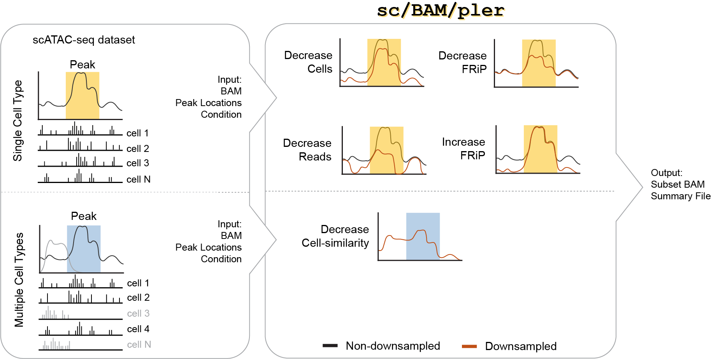

<p align ="center">

</p>

scBAMpler was developed to alter one aspect of a scATAC-seq dataset at a time: read count, cell count, and fraction of reads in peaks (FRiP) while preserving the original cell attributes. An extension was further developed which, using multiple cell types, will alter the cell-to-cell homogeneity of a population. For details, please see:

[Comparative evaluation of genomic footprinting algorithms for predicting transcription factor binding sites in single-cell data.](TBD)

## Installation

Please clone the repository:

    $ git clone https://github.com/aseveritt/scBAMpler.git

Then, create an environment with required dependencies. Installation and information about miniforge can be found [here](https://github.com/conda-forge/miniforge)

    $ conda create -n scBAMpler_env -c conda-forge -c bioconda python=3.10 numpy scipy pandas samtools bedtools sinto "setuptools<81" wget coreutils grep -y
    $ conda activate scBAMpler_env
    $ pip install h5py k-means-constrained #specific to cell similarity extension
    $ cd scBAMpler/
    $ pip install .


---------------

## Download Test Data

All inputs needed to run this tutorial are available on [Zenodo](TBD) as individual files, so you
can download only what the section you care about needs. Nothing in the tutorial requires you to
regenerate an input.

| File | Needed for | Description |
|---|---|---|
| `HEPG2_subset.bam` | Data Quality Usage, all steps | Subset of an ENCODE HepG2 scATAC-seq experiment, coordinate sorted. |
| `HEPG2_subset_standardized_500bp.bed` | Data Quality Usage, step 2 onward | Standardized 500bp peaks called on `HEPG2_subset.bam`, blacklist filtered. |
| `hg38-blacklist.v2.bed` | Data Quality Usage, step 1 *(optional)* | ENCODE exclusion list used when calling the peaks distributed here. |
| `peakmat_input.h5` | Cell Homogeneity Extension, steps 2–4 | Peak-by-cell accessibility matrix plus UMAP/tSNE embeddings for three cell lines combined (1,111 cells passing ArchR QC). ~15MB. |
| `union_standardized_500bp.bed` | Cell Homogeneity Extension | Union peak set across all three cell lines. Defines the row order of the peak matrix. |
| `K562_subset.bam` | Cell Homogeneity Extension, extracting mixed populations | Subset of an ENCODE K562 experiment. |
| `MCF7_subset.bam` | Cell Homogeneity Extension, extracting mixed populations | Subset of an ENCODE MCF-7 experiment. |

Three common cases:

* **Data Quality Usage only** — `HEPG2_subset.bam` and `HEPG2_subset_standardized_500bp.bed`.
* **Exploring the extension** — `peakmat_input.h5` alone is enough to run steps 2 through 4.
* **Extension end-to-end**, including extracting a mixed-cell-line BAM — all three BAMs, since that
  step needs reads from every cell line.

```
$ cd scBAMpler
$ mkdir -p test_data example_output   # every tutorial command reads from the first and writes to the second

# fetch what you need, e.g. for the Data Quality Usage section:
$ cd test_data
$ for F in HEPG2_subset.bam HEPG2_subset_standardized_500bp.bed; do
      wget -c "https://zenodo.org/records/XXXXX/files/${F}?download=1" -O "$F"
  done
$ cd ..
```

BAM indexes are not distributed. Build them for whichever BAMs you downloaded:

```
$ samtools index test_data/HEPG2_subset.bam
```

(`create-dictionary` will index a BAM for you if the `.bai` is missing, but the R helper scripts and
ArchR expect it to already exist.)

Each file's MD5 checksum is listed in the Zenodo record if you want to verify a download.

`peakmat_input.h5` is provided directly so the extension is runnable without installing R or ArchR.
See [Appendix: building the H5 from an ArchR project](#appendix-building-the-h5-from-an-archr-project)
if you want to regenerate it or build one from your own data.

---------------

## Data Quality Usage

### 1. Call Peak Locations *(optional)*

First, prepare your peak file. This can be done using any method you prefer—the only strict requirement is that the file be in **BED6 format**.
If you would like to use the peak standardization code from the manuscript, we provide it here.

These are R scripts and need their own environment, `scBAMpler_R_env`, which is separate from
`scBAMpler_env` and entirely optional. The same environment is used by the
[appendix](#appendix-building-the-h5-from-an-archr-project), so by default it also installs ArchR
and its prerequisites — roughly 350 packages. Pass `--skip-archr` if you only want peak calling.

```
$ bash helper_scripts/setup_scBAMpler_R_env.sh
$ conda activate scBAMpler_R_env

$ Rscript helper_scripts/peak_calling/call_peaks.R \
    --bam_file test_data/HEPG2_subset.bam \
    --outdir test_data/ \
    --peak_length 500 \
    --cores 8
```

#### Input Parameters
* `--bam_file`  
    - Path to the coordinate-sorted input BAM file.
* `--outdir`  
    - Directory where output file will be saved.
* `--peak_length`  
    - Length to which all peaks will be standardized.
* `--txdb`  
    - TxDb package used to get chromosome lengths.  
      Default: `TxDb.Hsapiens.UCSC.hg38.knownGene`
* `--cores` *(optional)*  
    - Number of cores to use with `mclapply`.
* `--exclusion_file` *(optional)*  
    - BED file listing regions to exclude from peak calling.  
      The peak files distributed on Zenodo were called with `hg38-blacklist.v2.bed`, which is also
      on Zenodo. Omitting it produces a different peak set, and therefore different FRiP values,
      than the distributed peak file gives.
* `--summit_file` *(optional)*  
    - Use this if a MACS3 file already exists to run only the standardization step.

#### Output
* `<outdir>/*_standardized_<peak_length>bp.bed`  
    - Standardized peaks in BED6 format.


### 2. Build Cell Type Input Dictionaries
Next, build a dictionary for each cell type you want to downsample.  
We assume the BAM file contains a cell barcode tag in the form `CB:Z:*` and both the bam and peak file are coordinate sorted. 

```
$ scBAMpler create-dictionary \
    --bam_file test_data/HEPG2_subset.bam \
    --peak_file test_data/HEPG2_subset_standardized_500bp.bed \
    --output_file example_output/HEPG2_subset.pickle \
    --verbose
```
   
#### Input parameters  
* `--bam_file`
    - Path to the coordinate-sorted input BAM file.
* `--peak_file`
    - Path to the peak file in BED6 format.
* `--output_file`
    - Path where the final dictionary will be saved (as a `.pickle` file).
* `--intersect_file` *(optional)*
    - Reuse an existing cell-barcode:peak-read mapping (`*.peaks.bed.gz`) and skip the bedtools intersect step.
* `--delete_intersect` *(optional)*
    - Delete the intersect file after building the dictionary.
* `--verbose`
    - Prints additional progress messages

#### Output    
* `<output_file>`  
    - A Python pickle file containing a dictionary of all cell barcodes, their mapping to peak and non-peak reads, and the necessary numeric encoders. (e.g. HEPG2_subset.pickle)
* `<outfile>`.summary.txt
    - A plain-text file with summary statistics about the cell type.  (e.g. HEPG2_subset.summary.txt)
* `<outfile>`.peaks.bed.gz
    - A gzipped BED-like file with two columns: cell barcode and associated peak-read QNAMEs.  (e.g. HEPG2_subset.peaks.bed.gz)
      *(Optionally deleted using the `--delete_intersect` flag.)*
    


### 3. Strategically Downsample BAM
Here, we specify which feature to downsample and to what extent. The maximum values are roughly outlined in the `.summary.txt` file generated in the previous step. For FRiP, these limits are harder to estimate, but the program will give warning if the requested FRiP is considered too extreme.

```
$ scBAMpler sampler \
    --input_pickle example_output/HEPG2_subset.pickle \
    --input_bam test_data/HEPG2_subset.bam \
    --output_prefix example_output/HEPG2_subset_c500_s12 \
    --downsample_by cells \
    --downsample_to 500 \
    --seed 12 \
    --nproc 10 \
    --output_fragment \
    --verbose

$ scBAMpler sampler \
    --input_pickle example_output/HEPG2_subset.pickle \
    --input_bam test_data/HEPG2_subset.bam \
    --output_prefix example_output/HEPG2_subset_r1e6_s45 \
    --downsample_by reads \
    --downsample_to 1000000 \
    --seed 45 \
    --nproc 10 \
    --output_fragment \
    --verbose

$ scBAMpler sampler \
    --input_pickle example_output/HEPG2_subset.pickle \
    --input_bam test_data/HEPG2_subset.bam \
    --output_prefix example_output/HEPG2_subset_f0.2_s33 \
    --downsample_by frip \
    --downsample_to 0.2 \
    --seed 33 \
    --nproc 10 \
    --output_fragment \
    --verbose
```

#### Input Parameters
* `--input_pickle`  
    - Path to the pickle file generated in Step 2.
* `--input_bam`  
    - Path to the coordinate-sorted input BAM file. Reads will be directly extracted from this file.
* `--output_prefix`  
    - Prefix for all output files.
* `--downsample_by`  
    - Type of downsampling to perform.  
      Choices: `"cells"`, `"reads"`, or `"frip"`.
* `--downsample_to`  
    - Target value for the downsampling operation.  
      For `frip` value should be between 0 and 1 (e.g., 0.2) and this represents the pseudobulk-level FRiP (not average per-cell)
* `--seed`  
    - Random seed for reproducibility.
* `--nproc`  
    - Number of processors to use.
* `--output_fragment`  
    - If set, will also output a `.frags.tsv.bgz` file in addition to the BAM file. Requires `sinto`.
* `--verbose`
    - Prints additional progress messages

#### Output
* `<output_prefix>.bam`  
    - Downsampled, coordinate-sorted BAM file.
* `<output_prefix>.frags.tsv.bgz` *(optional)*  
    - Fragment file corresponding to the downsampled BAM file.
* `<output_prefix>.summary.txt`  
    - Summary file describing the edit information and resulting statistics.
* `<output_prefix>.txt`  
    - List of selected read names.  
      Useful when storing a full BAM file is impractical. You can regenerate the BAM file later using this list:


### 4. Recreate BAM from stored text file. 
It is unlikely you will want to store the subset bams in long-terms storage. One option is to store the .txt files only and recreate the downsampled bam files directly if needed again in the future.   
```    
$ scBAMpler generateBAM \
    --input_bam test_data/HEPG2_subset.bam \
    --output_bam example_output/HEPG2_subset_c500_s12_REMADE.bam \
    --selected_reads example_output/HEPG2_subset_c500_s12.txt \
    --nproc 5

$ cmp <(samtools view example_output/HEPG2_subset_c500_s12.bam) <(samtools view example_output/HEPG2_subset_c500_s12_REMADE.bam) #returns nothing
```

---------------

## Cell Homogeneity Extension

### 1. The H5 input file

This extension takes a single input: an HDF5 file holding a sparse peak-by-cell accessibility
matrix plus a low-dimensional embedding of the cells. `test_data/peakmat_input.h5` is provided in
Zenodo, so **you do not need to build anything for this step** — skip to step 2 to use it.

The file format is the only requirement. Any file matching the structure below will work:

```text
peakmat_input.h5
├── peak_matrix/
│   ├── x          float64[]   Non-zero values of the sparse matrix
│   ├── i          int32[]     Row indices (0-based) of non-zero values
│   ├── p          int32[]     Column pointers (length = n_cells + 1)
│   └── colnames   string[]    Cell barcodes, one per column (length = n_cells)
└── embedding/
    ├── umap_df    table       UMAP coordinates per cell (see below) OR
    └── tsne_df    table       tSNE coordinates per cell (see below)
```

`peak_matrix` is a CSC-format sparse matrix of peaks × cells, reconstructed in Python as
`scipy.sparse.csc_matrix((x, i, p), shape=(n_peaks, n_cells))`. Row order corresponds to the peak
file used to build it (`union_standardized_500bp.bed` for the distributed data).

Each embedding table has four columns: (x coordinate, y coordinate, cell barcode, label column).
The label column is what `--label-col` refers to in later steps, and is the grouping variable whose
homogeneity you will be varying — `CellLine` in the test data, but it can be any categorical
per-cell annotation.

We generated the distributed file from an ArchR project. That route requires R and is not part of
the pipeline itself, so it lives in
[Appendix: building the H5 from an ArchR project](#appendix-building-the-h5-from-an-archr-project).

### 2. Make small, pseudobulks of identical size. 
Next, we build pseudobulk profiles and collect summary information to support a bottom-up approach for constructing mixed synthetic populations.

In this example, we cluster cells into groups of 50 within each CellLine. For real datasets, a larger cluster size (e.g., 500 cells) may be more appropriate. Although CellLine is used here to define groups, the workflow can be applied to any categorical variable.

```
$ scBAMpler make-pseudobulks \
    --input test_data/peakmat_input.h5 \
    --output example_output/medoids_s50.pickle \
    --dimred umap \
    --label-col CellLine \
    --cluster-size 50 \
    --nproc 5
```
                               
#### Input Parameters
* `--input`  
    - Path to input HDF5 file (peakmat_input.h5)
* `--output`  
    - Path for output pickle file (e.g. medoids_s5000.pickle)
* `--dimred`  
    - Embedding to use for clustering 
    - Choices: `"umap"` or `"tsne"` (whatever is present in h5 file) 
* `--label-col`  
    - Name of the grouping column in the embedding (column 3 of the H5 embedding table)
* `--cluster-size`  
    - Target number of cells per pseudo-bulk cluster (default 500 cells)
* `--nproc`  
    - Number of parallel processes for clustering. 

#### Output
* `*.pickle (specified by --output)`  
    - Python object containing four items:
        1. `embedding_df` — per-cell embedding coordinates with cluster assignments
        2. `medoid_df` — peaks × pseudobulks matrix of TF-IDF normalized accessibility
        3. `medoid_stats` — centroid coordinates and total read depth per pseudobulk
        4. `cor_df` — pairwise Pearson correlation matrix across pseudobulks


### 3. Generate Hypothetical Cell Populations
DESCRIPTION TEXT .

```
#Sample 2000 combinations from all clusters
$ scBAMpler mix-pseudobulks \
    --input example_output/medoids_s50.pickle \
    --output example_output/combos_all.csv \
    --groups all \
    --n-combos 2000 \
    --cluster-size 50

#Sample 1000 combinations from K562 and HEPG2 dominated clusters
$ scBAMpler mix-pseudobulks \
    --input example_output/medoids_s5000.pickle \
    --output example_output/combos_k562_hepg2.csv \
    --groups K562 HEPG2 \
    --n-combos 1000 \
    --cluster-size 50

cat combos_all.csv combos_k562_hepg2.csv > combos_combined.csv
```

#### Input Parameters
* `--input`  
    -  Path to pickle file from make-pseudobulks
* `--output`  
    - Path for output CSV file
* `--groups`  
    - Labels to restrict sampling to (dominant label per cluster), or 'all' for unbiased sampling across all clusters
    - Choices: `"all"` or comma separated list of label sets to specifically mix e.g. `"K562, HEPG2"`
* `--n-combos`  
    - Number of random combinations to generate (default: 2000)
* `--cluster-size`  
    - Cells per pseudo-bulk cluster
    - Should be a muliple of the clusters layed out above-- amanda I think we can infer this directly.
* `--ft-sizes`
    - Target footprint sizes in cells to sample combinations for. Combinations of r=ft_size/cluster_size clusters are drawn.
    - (default: 500 1000 2000 5000 10000 15000 20000)
* `--label-col`  
    - Name of the grouping column (default: CellLine)
* `--nproc`  
    - Number of parallel processes (default: 8)
* `--seed`  
    - Random seed for reproducibility (default: 42)

#### Output
* `*.csv (specified by --output)`
    - CSV with one row per hypothetical cell population:
      group_medoids             list of included cluster IDs
      total_peakreads           total raw read depth
      mean_pearson_corr         mean pairwise Pearson correlation
      sse_pearson_corr          SSE of pairwise correlations (cohesion)
      dominant_label            most common label
      dominant_label_perc       % of cells from the dominant label
      closest_label             label centroid closest to this combination
      label_dist_*              distance to each label's centroid (one col each)
      groups_sampled            value of --groups used to generate this row


### 4. Select Cell Populations of interest and optionally write cell-barcodes for downstream analyses. 
DESCRIPTION TEXT .
        
```
#Alternatively, if you want to visualize the distribution in a notebook and output from there you could run something similar to
helper_scripts/inspect-select-combos.ipynb

$ scBAMpler select-populations \
    --input example_output/combos_all.csv \
    --pickle example_output/medoids.pickle \ 
    --output selected/ \
    --ref-labels K562 HEPG2 \\ ???? AMANDA
    --n-per-group 20
```

#### Input Parameters
* `--input`  
    -  CSV from gen-pseudobulk-combos
* `--pickle`  
    - Pickle file from make-pseudobulks (needed to resolve cluster → barcode mappings)
* `--output`
    - Output directory (created if it does not exist)

* `--ref-labels`
    - Reference labels to use as the X axis for selection.
                        One selection pass is run per label.
                        (default: all labels found in the data)

* `--n-per-group`
    - Number of combinations to select per reference label per read-depth bin (default: 20)

* `--write-barcodes`
    - If set, write one CSV per selected combo with columns barcode and label, suitable for sinto filterbarcodes.

#### Output
* `selected_combos.csv`
    - All selected combinations with full summary stats
* `barcodes/`
    - (if --write-barcodes) One CSV per combo: combo_<ID>.barcodes.csv  with columns CB, <label_col>

      
---------------

## Appendix: building the H5 from an ArchR project

This is how `peakmat_input.h5` was produced, but it's not a required step — the end file is in the
Zenodo archive. Any file matching the schema in the extension's step 1 will work. This section
exists for two audiences: anyone reproducing our inputs from scratch, and anyone adapting the
workflow to their own ArchR project.

`helper_scripts/H5_from_ArchR/MakeH5.R` extracts a peak matrix and embeddings from an ArchR project and writes
them to HDF5. It requires:

* **The `scBAMpler_R_env` environment** — the same one used for peak calling in step 1 of the Data
  Quality Usage section. If you have not created it yet:

    ```
    $ bash helper_scripts/setup_scBAMpler_R_env.sh
    $ conda activate scBAMpler_R_env
    ```

* **One BAM per cell line**, coordinate sorted, with barcodes in the `CB` tag. The distributed data
  uses `HEPG2_subset.bam`, `K562_subset.bam`, and `MCF7_subset.bam`.

* **A union peak set** spanning all cell lines, which defines the rows of the matrix. Build it by
  calling peaks per cell line, then merging with `--union_files`:

    ```
    $ Rscript helper_scripts/peak_calling/call_peaks.R \
        --outdir test_data/ \
        --union_files HEPG2_subset_standardized_500bp.bed,K562_subset_standardized_500bp.bed,MCF7_subset_standardized_500bp.bed \
        --union_outfile union_standardized_500bp.bed \
        --cores 8
    ```

With those in place:

```
$ Rscript helper_scripts/H5_from_ArchR/MakeH5.R
```

Input paths, sample names, and the output filename are constants at the top of the script —
edit them to point at your own data. The script builds arrow files, adds the peak matrix, runs
iterative LSI, then UMAP and tSNE, and writes the result to `test_data/peakmat_input.h5`.

Note that ArchR applies its own QC filtering, so the cell count in the H5 is smaller than the number
of barcodes in the input BAMs: the distributed file contains **1,111 cells** from an input of 5,000
barcodes per cell line. If you rebuild it and land near that number, you are in the right place.

---------------
## Citation

If you use scBAMpler in your research, please cite it!

```
@article{TBD}
```

